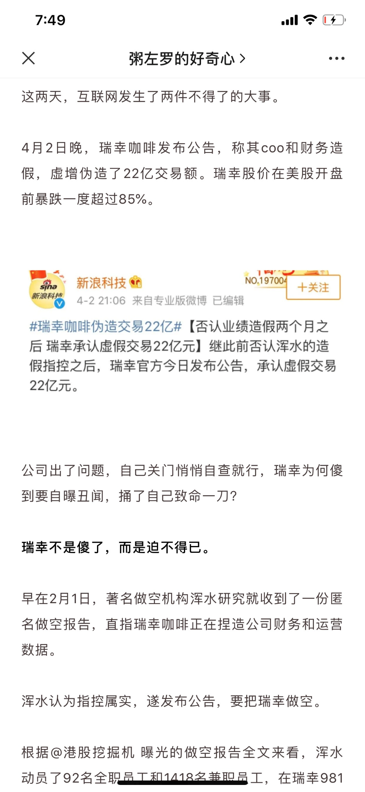
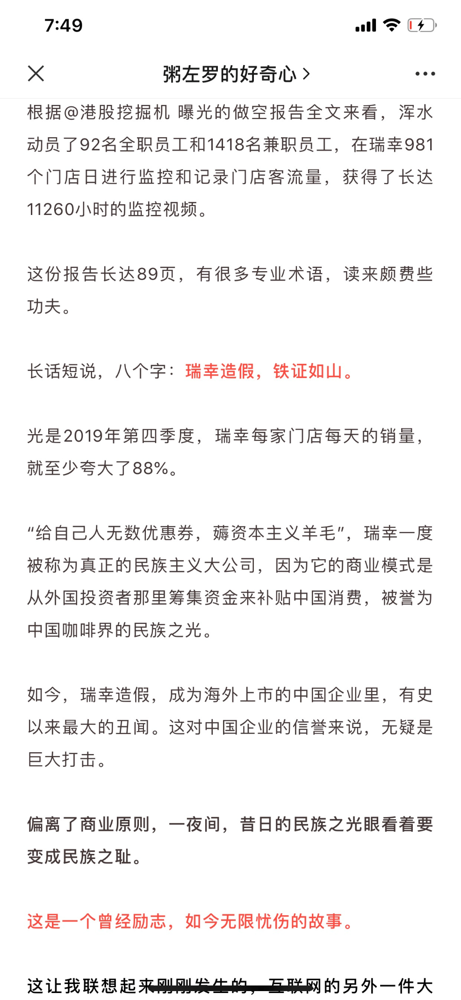
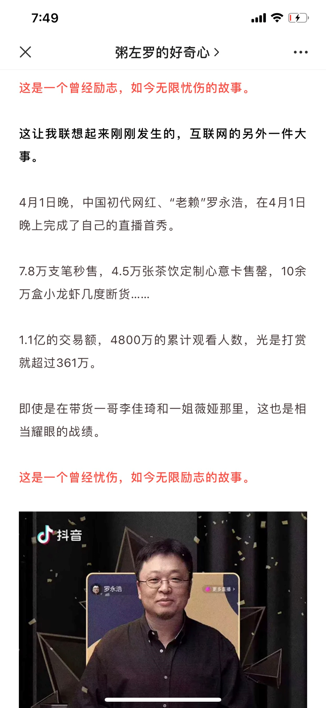
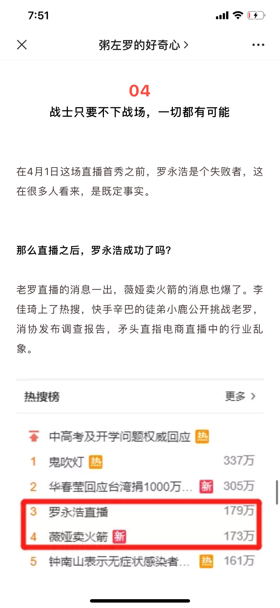
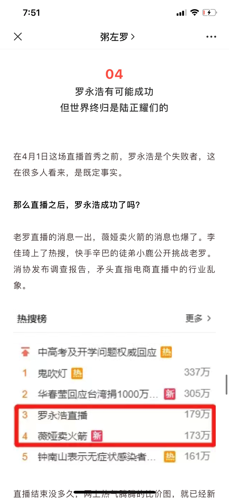
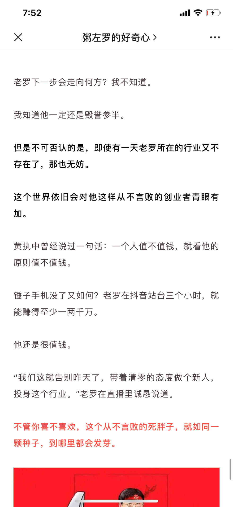
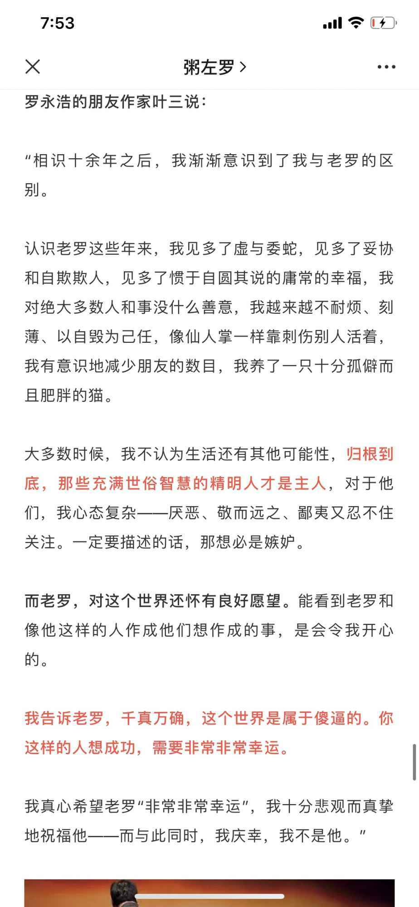

# 0408粥老师手把手教改稿.第一篇

> 原文由 DOCX 转换而来。保留原文段落顺序；文档内图片已提取到同名 `-media` 文件夹。

下次直播的时候，同学们互相拉拉你的好朋友进来听哈。这个太不容易了。100多个人才进来了30个人，马上就要开始了。看评论区的这位同学留言，我真的是过气了。需要刷人次了，已经太惨了。

然后大家可以去关注我的视频号哈，我在这里没落了，但是我在视频号上正在犹如一颗新星冉冉崛起，我今天突然发现我视频号不错，然后前几天的视频有3万的观看数了，昨天的有12000了，然后今天凌晨发的也有接近1万了。

大家也可以看看自己有没有开通这个视频号，好像今天下午4点多的时候，官方又给开通了一批，我们办公室里有两个小伙伴都开通了。下午4点多的时候。大家也可以看看啊，如果有的话，你也可以尝试做起来，反正都是做内容嘛。你会发现多视频号也需要写文案。你不管是拍故事还是像我一样，对着镜头讲一点东西都是需要你用心。写作的能力是打一段话或者一个小故事，写出来，其实大家来高阶营的都是写作的。

你做一做视频号，其实也是在练习写作，如果开通了的话，也可以试试。昨天在视频号上讲的是“如何让自己的女朋友不喜欢钻戒”，今天晚上，我会拍“一个如何让自己的女朋友不喜欢买房"，这样一个男人就幸福一生了。

好，我们开始今天晚上的直播分享。今天的主题是改稿，我们大概一共有三次直播，像改稿第一次是有点特殊，第一次我会首先把方法论给大家讲明白，然后附带去拿出一篇文章，就是你们今天已经预习了的一篇改稿。大概简短的讲一讲，因为那个稿子是改局部不是改整体。

基本上把主题开头结尾和核心利益去改就好了，所以那篇文章大概我改的时候花了一个小时。然后呢，我们到第二次改稿课第三次改稿课的时候，才会拿出每一次一篇相对需要较多调整的文章来逐一告诉你。

所以这节课，我们大概可能接近一个小时的时间，可能前面40多分钟都是在讲改稿的一些方法论，然后最后拿出20分钟来讲讲我们今天已经预习了的稿子。改稿是我们高阶营中学习非常重要的一部分，因为没有任何一篇稿子，一出手，就是完美的作品，我们大部分人写稿子都要经历一遍一遍的打磨。

实际上，如果不是像我们这样的课，你其实可能根本不知道怎么改稿或者说你根本接触不到你平时去听一些写作的课程。现在写作的训练营大概率上也是没有这种手把手的改稿课的。同时呢，大家其实也没有机会去坐在一个大咖旁边，去看他怎么改稿子。我带人的时候，大家成长还是蛮快的，其实有一个非常重要的原因，就是我可以亲自给他改稿，同时，我改的时候，他能看着。

我刚开始带的一个编辑，叫文七，那时他已经写出了很多爆款，像高晓松那篇60万阅读量，肖申克，有一篇20万阅读量，今年疫情之下也写出来了很多爆款10万+的文章。他进步很快，就因为我是去年5月份把他招进来的。然后最初他写的每一篇稿子，我都要去改。

我改的时候可能短的一个小时，长则两个小时以上。他会搬一个凳子，坐到我旁边，每一句话，每一个词，甚至标点符号，怎么去改，他都看在眼里。然后我通常还会告诉他，改的原因。

所以在这种情况下，他就会进步很快。有可能我给你一个初稿，再给你一个终稿，你也能看到改前和改后，但是从中我有什么思考，你是看不见的，比如说我今天给你们看的两个预习的文章，一个就是初稿。

一个是终稿，你能看到两个有很多的不同，但是我中间的思维的过程，你是看不到的。所以这门课，你能听到我到底是怎么思考的，我改一个稿子的时候，我会从哪几个方面去入手，然后从哪些标准去衡量判定怎么改？有哪些技巧？改稿就是进步最快的方式，其实你在学完技巧之后，更快的进步就在来自于实践，而在实践中更快的进步，就是刻意纠正。

很多人经常说的一个词叫刻意练习，其实还不够可以纠正，其实是更准确的，因为你一直练一直练，然后有的人练了两三年了。其实他犯的错误，如果没有人给他纠正的话，他其实那一整年，他都在重复的犯同样的错误，甚至第二年还要重复犯那样的错误。但是，你在练习的过程中，每一次刻意纠正犯过的错误，下一次不再犯或者是重复犯的次数越少，那么，你的进步就越快。

其实就像我们高考的时候，整个高三，我们就是用这种方法在练习。比如说数学最后的问答题，一共就6道，其实那解题的方式其实也没有那么多。无非就是在你一遍遍练习的过程中，纠错说，“你应该怎么做、不应该怎么做、下次再也不要犯这样的错误了”，其实我们上学的时候，老师跟我们说的最多的一句就是：下次别再犯这种错误了。这个其实就叫刻意纠正。

我们走到社会中，我们做很多工作的时候，其实我们没有太多的机会去做刻意纠正。所以这样的课，其实还是蛮重要的。有个同学说，瞬间想进粥老师的团队，其实这是一个美好的想象。大部分进了我们团队的人，都会很痛苦，可能就感觉要熬不下去的。

因为我们的要求很高，而要求高就有一个特点，就是说，你可能一直做选题，一直被毙。然后一直写稿子，一直不被认可。

因为还没有达到我们的标准，我们可能就会不给你发，让你继续写的等等，这个就是说你在工作的过程中缺少那个发出来之后的那个用户反馈，这样其实会导致你进步，所以在我们这里也不一定是一个好的选择，我经常跟很多人说，找到一个适合你发展阶段的一个平台，是最好的。

不一定是一个最顶级的平台，我之前跟我一些学员或者是一些同事讲，我说，当年我做新媒体小白。那时候啊，刚入行，我加入的是创业邦，所以我走到了今天，如果当年我加入的是36氪，我很可能走不到今天，为什么呢？因为我如果加入了36氪的话，以我之前的背景是一个服务员。没有写作的基础，没有过往的新媒体编辑的经验，更没有做记者的经历，他们可能就不会让我去写原创文章，更没有机会发表在头条上，那我这样就不会有持续的接受反馈，持续的进步。

而我在创业邦的时候，他们的要求相对低，而且当时是一个改革阶段，是从网站杂志改版的。到这个新媒体团弄了一个阶段，所以当时的管理没有那么到位，公众号也并没有受到那么大的重视，虽然当时已经是一个有30多万体量的账号了。

那个时候大家做了选题，不用给总编审，写完了稿子也不用给总编审，就说你想写什么，大概率上你自己决定了，你就可以写你要你写的，写完以后你自己觉得没问题，就可以推送。然后只是新媒体小组里互相预约一下时间就可以发送，当时一天可以发三次，所以位置还是蛮多的。那种情况下，我才持续的去写作，持续的接收反馈和持续的进步。

所以给高阶营的同学讲就是一个一个的技巧的训练和一个一个方法的训练，学习和掌握，那么高阶人更重要的就是一篇长文的写作以及每次写作之后的刻意纠正，然后一次来实现更大的写作上的进步。那我们就开始讲这个改稿的整个方法论的层面啊。

整体上的改稿一共有三大板块，第一大板块就是改关键成败点，也就是文章的框架。因为任何的事情都是要先搞定关键节点。修改文章也是这样，一定是先从整体到局部再从局部到细节，也就是你要先修改最重要的最核心的东西。

因此呢，修改文章就是在明确文章利益的基础上，从框架着手，如果框架出了问题，你这篇稿子，细枝末节的地方改的再多。那都是一个治标不治本的一个过程。所以我们第一个部分呢，就是改框架。

第二个部分就是改具体内容表达的切题性，也就是你的框架部分可以了。要修改具体的内容了，也就是中间的正文啊。正文上更多的是我们会说出问题，一般出在哪里出在内容的前提性上，你写的每一句话，每一段话，每一个用词是不是在很好的论证，你的主题如果论证完美了，你就是一篇好文章，如果你有很多很漂亮的话，但是它们不是服务于主题的，那这些其实都是叫漂亮的废话。漂亮的废话也是废话啊，虽然这段话很漂亮，但是没有用，你应该果断的删掉。这是第二大板块。

第三大板块呢，就是改逻辑观点和案例逻辑。换言之就是你的脉络从上到下是不是有力量的？这个是非常重要的，然后是改观点，你的观点是不是好？你的观点能不能自圆其说，你能不能逻辑自洽，然后你的案例是不是能够匹配你的观点，因为有的人说了一个好的观点，然后没有很好的案例，这个是不行的，有的人就是自己既有一个好观点，也是一个好案例，但他俩匹配在一起就不好了，也就是不匹配。

所以这个就是说，我们改稿要从三大方面入手，那具体呢？大概又有10个小东西啊，我们来逐一讲这三个板块，每一个板块具体的内容。

所以我们回过头来说，第一点是改关键节点也就是文章的框架，其实文章的框架有哪些？我们梳理一下其实一共就四个：

第一个是标题、第二个是小标题、第三个是开头以及第四个是结尾。这4个加起来，其实就是一篇文章的框架，这4个东西你整不好，你文章的细枝末节啊，改的再多都是事倍功半。那这四点，我们先来说，对于第一个标题：你怎么去看标题或者你怎么去改标题啊。当你去改这个东西的时候，其实就是拿他本身最好的标准是什么，拿这些标准去验证他。我们说标题最重要的标准是什么，就是有没有足够好的打开率。

之前咪蒙还这个在新媒体上活跃的时候，他经常说要看你的标题。能不能在一秒钟抓住用户的注意力，当你的文章的标题出现在帐号列表上，出现在这个朋友圈里的时候，别人刷朋友圈刷列表的时候。能不能一下子，就那一瞬间，可能就一秒甚至半秒时间就被你的标题所吸引。你能不能满足这个标准。那我们说改文章改这些东西的时候，其实都是这样，你改好标题，就要拿标题它最好的标准去验证他。

具体我们可能说，“你这个标题有没有痛点？你这个痛点是不是真痛点？是真痛点的话，那是不是大多数人的真痛点，是大多数人的真痛点的话，那是不是大多数人的真的高频痛点呢？” 这个就是一系列的验证，那你接下来还要问，可能你说这个标题能不能激发用户的好奇心呢？能不能引发大家的共鸣呢？这样一验证你可能就会说，我这个标签还不合格，那我就要再想一想了，我要再改改了。

你如果不这样检查、检验，也很可能就写完一篇文章，就觉得差不多了，然后就把它发出去了。其实这就是说，你在关键节点上很很懒，你在你在这个关键节点上，比如说写稿这个时候，你很勤奋啊，这个就是所谓的战术上勤奋掩盖战略上懒惰嘛。其实标题还有一个非常重要的标准，就是你有没有转发阻碍。

因为有很多标题呢，他打开率可能很高，就是我一看到这个标题，我得打开看看我不打开看的话，我心痒痒啊，或者是太有共鸣了，必须点开看或者是太博眼球了，我要点开看看，但是这样博眼球的标题，有可能打开率很高，但是它不利于转发，为什么呢？因为转发是转发给谁看啊？朋友圈里要么就是你的同学那么就是你的朋友，要么就是你同事，还有各种合作伙伴、亲戚等等。你不会转发很low的东西到这个朋友圈里。你不会转发很容易引起这个价值观撕裂的东西到朋友圈里等等。

所以呢，你要做一个打开率高的标题，你还要做一个转发，没有阻碍的标题，这个就非常重要了，因为很多人看了一个标题，他特别想点开，但是。他转发的时候才会考虑这个标题转出去是不是不太合适，所以你得想。

然后我们说框架的第二个部分就是小标题。那你的小标题要注重什么呢，就是你要问你写的这一组小标题。是不是非常好的服务了你的主题，这个是非常重要的，因为很多人他写文章可能比如说写长文写的很长三四千字，那每一个部分其实他可能写一两个小时，这些导致你写这个部分的时候。可能是上午也可能是下午，或者有时候容易自己发挥太多，就导致很多东西不是紧紧围绕着主题来展开的，那么你在取小标题的时候，有可能你过于去针对看你这一部分写的是什么，而忘了它是不是要服务于你整个主题。

我觉得有一个很好的办法，比如你把你想要提供有三四个标题单独拿出来，放在一起，你看看他们。有很多人，他写了一篇文章，他三四个小标题放在一块儿就好像不是一个文章里出现的，好像上下没有关系，比小标题一和小标题二没什么关系。小标题和小标题三也没什么关系，相互之间都没有关系。

所以你会发现，比如说你去看我写的很多好的文章，你单独把小标题拎出来，你会发现他上一下是很有逻辑的，上下形成有逻辑的同时呢，每一个优势很好的服务于这个主题的，也就是他可能跟标题还是有紧密联系的，所以你要检查这个事儿。因为这个是更重要的一个内容，主体的框架其实相当于你搭建一个房子，这个东西是更重要的。

然后还有一个非常重要的，就是小标题也要比较吸引人的注意力。为什么呢？因为你是长文而现在是一个碎片化阅读的时代，那大家可能会扫读啊，或者是说他先扫一下看看值不值得读或者他先扫一下看看哪个部分呢，更感兴趣，所以如果你的小标题不吸引人或者我看到小标题时不知道你这个部分可能会在写什么？

那这个就没有达到效果。所以有很多人问我小标题应该怎么写的时候，我其实就回答他一句话，你怎么根据文章提炼文章的标题，你就怎么根用小标题下的内容去提炼小标题，而且取标题的技巧和取小标题的技巧是一样的，让大家一看到这个标题，就想打开这篇文章，那你取小标题的目的也是让别人看到这个小标题就很想看这个小标题下面的内容，达到这样的效果小标题才有用。标题的逻辑和技巧去做小标题就完事了。

然后我们说框架的第三个部分，也就是文章的开头。那开头怎么去验证？我们还是说要拿那个元素最重要的最好的标准去验证。那开头最好的标准是什么？那我们就要想开头的作用是什么，我们其实已经强调，很多次了，一篇文章的开头应该是一篇文章最优秀的推销员。

这个怎么理解呢，就是一万个人点开了一篇文章，其实并不意味着一万个人会看这篇文章，有可能1万个人点开了，但是有5000个人扫了一眼就退出去了，为什么呢？因为你的开头没有把这个文章推销成功，你没有说服读者，让他继续往下看。

讲到推销员，其实最近还有一个小新闻，就是大家在讨论说这个这个海底捞开业了吗？开业了之后啊，他们为了冲业绩，服务员更加努力，以前是站在门口迎宾，后面就是跑到电梯口，迎宾这什么意思呢，就是说这个商场里每天这个楼层人来人往的流量。可能比如说是一万人，那实际可能只有3000人注意到海底捞这家店了，那注意到的有可能只有200人被他吸引了，至于最后进去的就更少了。

那其实说海底捞的服务员去往里拉客人就相当于说跟我们去做文章的开头一样，也就是说，有一万个人的眼睛他已经占到了这个文章的面前，他有可能被你吸引住，有可能去认真的读下去嘛？对于这个为问题我们的做到能不能用开头把他们成功说服。我最近做了一些转载，有很多时候我会在文章的开头去写一个推荐宇那个其实就是一个我强有力的销售的作用，你听完我现在讲之后呢？

你可以去打开“粥佐罗”这个公众号，今天晚上的推送。大概原标题是《这个问题搞不懂，再努力也没用》，后来有个账号给他取了一个很牛逼的标题，叫《输入的是垃圾输出的只能是垃圾无论多努力》。这个讲的是一个，垃圾内容输入和垃圾这个观点输出的一个东西，就是说像我们写作的人都知道，一个人能输出什么，写作什么，他其实是源于他输入了什么，他阅读了什么，他过去的经历的人和事。

这个文章的观点很牛逼，所以，我在开头为了让大家尽可能的只要点开，就把这篇文章读下去，我就写了一个推荐语去推荐这篇文章。大家，听完了我的这个分享也可以去看看我是怎么给这种文章写推荐语的。

所以，每当你写完一篇文章的时候呢，你要去看看你的开头，问一问，你的开头有没有做好一个推销员的工作？如果没有你要继续打磨。

然后再接下来，我们要讲框架的最后一个部分，就是结尾，结尾依然有他自己的定义标准，比如说从结构上，他是不是对全文有一个总结式的升华，有一个呼应，有一个提纲挈领的感觉？

讲到这里，我必须要给大家说一下，就是很多写作的新手，他操作长文的周期有点长，有的人可能说写一个长文要花两天的时间，有的人要花一天的时间还是差不多一大半天，可能上午写下午还要写，晚上才能写完。

那这个就导致了一个什么东西呢，就是，很多新手的文章是，前紧后松，这个紧和松指的是质量，也就是他前面刚开始写会字斟句酌，非常的耐心的打磨每一句话，每一段话，然后越写越累，越写越累，就容易应付一下，然后就导致文章的后半程质量明显没有前半程好。

然后到结尾的时候，就更差了，因为当他终于写到结尾的时候，他会心想，终于写完了，然后把笔放下了。然后把那个这个文章一保存往那一个北京瘫在那儿坐着休息一下，其实就是说你虎头蛇尾了，因为，你可能说写的很累，所以你到后面不会注重，但其实呢这个都是我的一个实际经验和我看很多人的稿子，这么一个很接地气的一个经验，所以大家要注意这个写稿子，一定要均匀的用力，要质量也要非常均匀。

所以我们才要说你要在写完的时候，好好的再看一看你的文章的最后的一个部分，或者是说你文章的结尾是不是好。

那我们可以看一看，一些好的结尾是什么，比如说，我最近刚写的这个暴文就是罗永浩这个直播。

我写罗永浩直播的文章的时候，有一个讲别想拿业余挑战专业的文章，我结尾，是这样结尾的。我说，罗永浩1972年出生，再有两年就50岁了，一个快50岁的人创业屡战屡败，却依然坦然面对，失败了就继续干，欠债就放下面子，努力还债。

面对年轻人玩的抖音直播，我们大多数年轻人都落后，他快50了还要勇敢的去尝试去适应，很多人30岁的生命状态，有老罗好吗？没有。很多人觉得自己30岁了，一切都改变不了，放弃了，佛系了，但快50岁的罗永浩依然这样说，我还年轻，我还有很多可能性。

就大概这样一个结尾，你会发现他非常好的一个情绪点啊，就觉得哇，其实应该尊重老罗，然后后面我又讲了讲这个，任何领域里别用业余挑战别人的专业，然后最后最后一张图，我用的是两年前的薇娅和李佳琪，这个还是说在文章的结尾对读者的情绪有一个高点刺激。

为什么呢？因为用户已经读完了，他读到这的时候，他对你这个文章消费已经结束了，那么结束之后，你希望他干啥呢？你当然是希望他至少给我点一个在看吧，他至少再给我评论一下吧，我们最终极的是希望他干啥，最终极的，当然不是希望他打赏，是希望他把文章分享到朋友圈，分享给朋友，分享到微信群等等。

所以你如果在结尾上不花功夫去做一个情绪高刺激或者是一个很忠心的提炼或者是说一个很核心的观点，金句，那么其实大家转发起来的时候动力就会小很多。这个大概也就是是风中定律那个心理学的一个技巧吧。

好，这是文章的改稿的第一个部分，也就是我们怎么去改一篇文章的框架。

然后接下来，我们要讲第二个部分就是改内容表达的切题性，我们也主要是说方法论。这个部分有3点。

第一点就是：一切内容要往主题上去靠，你要点破他。

什么叫点破呢？就是你讲了一个故事，那么你希望这个故事，大家看完了有什么样的启发，得到怎样的认知，形成怎样的总结或者经验，你要把这个东西给他写出来，这个叫点破。

哪怕你不用写太多，你总要写几句，为什么呢？你不点破他，那么用户就需要自己去提炼，自己去思考，自己去总结，而用户的表达提炼总结能力都是比较差的，这个不是说我怎么知道，因为80%人都是这样吗。所以你要去帮用户去点破他，而不是让用户说，我看完了一个东西，自行体会。这个东西就叫一切往主题上靠的做法。

你是希望用户在看你写的故事案例时，不要忘记了主题，不要忘记了我为什么要给你讲这个故事，讲这个例子。我跟你讲，是因为我想让你明白，我讲的这个主题是什么，我讲这个认知或者这个观点是什么，我要让你时时刻刻心心念念的挂念着我文章的核心思想。这样这个用户读完的时候，他就会对主题有更加深刻的印象，更容易被你说服。

比如说罗永浩直播那个文章其实在大号上发了一下，在小号上发了一下，大号有130万的阅读量，小号有150万的阅读量。就这样一篇文章，在两个号上就有接近300万的阅读量。那篇文章其实是值得你去研究的，像我写的是说关于赚钱要放下面子赚钱，然后你要爱钱，你不爱钱就赚不到钱，你爱钱，你就会想办法赚钱，你想办法赚钱就会真的能赚到钱。

我大概就是这样一个主题，你可以去分析，我在去举每一个例子或者讲一每一个故事的时候，我其实都在往主题上去靠拢，我只有这样靠拢，他才会在读这篇文章的时候，一直想念着主题，还知道我在为了主题而论证而服务，那这样的话，才能到最终的时候，用户直接被你说服了。然后这样，他才会印象深刻嘛，他才会转发分享嘛，所以你可以去看看那个。

一切往主题上靠要点破他，那反面是什么？反面就是你讲观点的时候就讲观点，你不讲案例，然后你讲故事，案例的时候，你就不提观点，这就是叫这个反面。

很多新手的作者，现在写文章就有这样一个毛病啊，就是很分离的去写，那样的话，其实就是没有把观点和案例或者认知和案例很好的融在一起。

具体内容表达的切题性他还有第二点就是说别发挥太远，要克制，要防止情绪的转移或者丢失，什么意思呢？就是很多写作者呢，写东西的人都有一个表达欲，可能说我不去写的时候没有那么多想法，但是你一写起来，一打开了这个话匣子或者一打开这个思路，这个表达欲就上来了。表达欲上来呢。他写a的时候，他可能就会想到了b和c，然后呢，这个那b和c可能是他表达a的一个工具。

那你只是作为一个工具的时候，就是说我写b和c都是为了去回到a，结果呢，很多人就搂不住，他写c写b的时候，都展开了越走越远，到最后，嗯，好像我开始主要是写b了，又开始主要是写c了，而不是说我写b和c是为了论证a，很多人他写东西呢，就写着写就跑偏了，就跑远了，所以很多人为什么说，你这个文章主题不明确，你文章主题很散，就是这种原因，你写着写着就跑，老是被自己拐走了。

写一篇文章，非常重要的是什么？是情绪。

那你写的散，你主题不明确，这导致一个什么东西呢，叫情绪的分散，情绪最好的处理方式是什么？就是从头到尾，你贯穿着一条线，你中间不要分岔太多，你好不容易营造了一种情绪，但是你中间跑偏了，大家就会把你酝酿好的情绪又搞丢了。又偏到另外一个东西上，去感受另一种情绪，所以你写东西，其实为了引发一个情绪，那么，当你拐到b和c的时候，你酝酿出来的情绪就中断了，然后发生了转移或者丢失，然后你再回来再酝酿一次，他其实是一种情绪的浪费，所以呢，要克制，要克制。

内容切题性的第三点，我们要讲的是，内容结构。立意结构，不要太复杂，这个立意是立刻的立，意思的意。

大概是《文心雕龙》里面有一句话，叫驭文之首术，谋篇之大端。什么意思呢，就是一篇文章最重要的，其实就是他的立意，我们这个写文章的时候啊，又不是说写大部头的小说，小说是很复杂的，比如说红楼梦非常复杂。咱们写一篇3000字的文章，4000字的文章结构利益上一定要简单，不能很复杂。

最好是单条线的或者是你就把一个东西说明白就行，你不要去说跟他相关的太多或者是他的反面或者是他的并列的点，你就说他一个点就好。我给你举个例子，你就明白了。

比如说我写过两篇文章，一篇文章叫《年轻人，没事别想不开去创业》，然后我还写过一篇文章《有这三种特质的人一定要去创一次业》，你看这两篇文章，其实每一个都是一个立意。第一个我说没事，别去创业，然后说，创业很苦很累，各种麻烦事儿，然后第二个就是相反的，我就说哪些人可以去创业，有哪些特质可以去创业，但是呢，我肯定不会把这两个东西揉在一篇文章里去写。

为什么这样说呢？因为很多人他就会这样写，他可能就一上来写些哪些人不适合创业，然后后面又写写哪些人适合创业，那可能到最后哪些人都不给你转，创业者不给你转，想创业觉得自己不适合的也不给你转，因为你太分裂了，或者是你的情绪不统一，他不是一条线贯穿下来的。中间有情绪的转移和丢失。

比如说我写过两篇文章，一篇叫《这才是一个人开始走下坡路的三种迹象》，然后还有一篇叫《一个人注定越混越好三种标志》，其实有的人也会把它放在一起写，千万不要这样啊，因为你这样写的话，情绪他就有一个互相抵消的一个过程。你表达一的时候，他营造的是一这个情绪，他再走上坡路怎么怎么样，结果你后半部分又写了一个人越混越越差的三个东西，那他这个情绪往下走，这就中和了，其实那你说你纯粹的正向，这个正面正唤醒和这个负面的低唤醒你都没有把它给弄好。

所以，我觉得写文章的时候，尤其是说我们短的文章，你把要表达的聚焦给一条线就好了，太复杂的利益其实你驾驭不了，尤其是你不知道怎么去减少这种自我抵销，很容易到最后是一篇失败的文章，你两方面都想兼顾你最后什么结果都没有拿到。这是我们说的改具体内容表达的切题性的整个第二个部分。

然后接下来我们要讲第三个板块，就是改逻辑观点和案例。

那第一点，就是逻辑啊，其实逻辑呢，更多的是一种说服力，这个其实理解起来很简单，我们后面更多是用案例来给大家讲，如果你看别人的文章的过程中，老是不断的想质疑对方，那就说明对方这个文章的逻辑不好，他很容易能够让你产生质疑。

逻辑是什么？逻辑他其实是一种力量，一种一环一环的这种力量。那我们说最常见的叫因果逻辑。因果逻辑，他其实就是一种顺序，一种逻辑力量的顺序，就是你看完了这个因，你特别想知道果。你如果先看果，你也必定特别想看因，大概就是这样一个道理。

那我说观点比较重要的是什么呢？观点就是你能否立得住，能否经得起推敲，能否自圆其说。很多人写观点的时候，自己都不能把自己说服，别说去说服读者了。有些观点，其实很奇怪啊，比如说像我们之前有个作者，他报选题的时候，有一个观点，叫比现金流更重要的是心流。那这个就是一个很奇怪的观点。

这是怎么造成呢，就是有一些新手，一些写作的新手，他为了押韵或者造型，然后感觉句子上造型很美，然后就不注意这个观点是不是立得住。你说刚才我说的这个，现金流和心流，他们虽然都带了一个流，他们完全不是一个维度上东西对吧。所以你把他放到一个维度上去比较，但他本质上不是一个维度，所以这种东西就无法自圆其说。这就是相当于你说，哎呀，比渣男更可怕的是母狗，你说人和狗他不是一个维度，你非得这样去比较是吧，不要，不太合适，立不住吗。

那第三点，我们说的是案例，你的案例要注重什么呢？就是，首先要注重的是叫合情合理。

我给一些编辑改稿子的时候，我会发现啊，原来案例的选取是很多初学者经常做不好的一点啊。就是经常做不到什么，做不到合情合理，你不合情合理用户就会觉得很假。其实呢，这个很多人写的文章，一些读者一看他就会说你这个例子太假了吧，很明显感觉不是这样啊。

比如说，我开头提到了视频号。我看视频号的时候呢，我就看到有一个自媒体同行叫小北，他也是一个百万级的大号，他也做视频号，他视频号里面其中有一集是拍的他的创业一些想法或者思考。那个短视频评论区被怼的很厉害，为什么呢？因为他里面有些这样的表达，比如说;他说，他有多少个员工，然后呢，又说他创业的话，每个月固定的支出要有多少，那别人就他算，说你这些支出都发给员工当工资不算别的，你的员工工资也太低了吧。

然后他说，他在北京租了一个多少平米的一个办公室，就很大啊，应该是这个几百平上千平，每个月光房租要几万，应该大概,给出了一个数是10万，还是多少来着，然后，下面又有一堆人怼他说，你这个太假了吧，北京的这个房租能有这么便宜吗？

这个其实就是说你举案例的时候，你经常要去思考，他是不是合情合理？我们有一个作者在我们公众号上发过一篇文章，就讲副业赚钱的，其中也特别巧，他也用到了小北，他其中有一句话大概是这样说的，小北在2012年，出了第一本书，然后2013年又出了第二本书，然后第三年他就在北京买了一套房子，我当时就把他这一段话给删了。

为什么呢？因为你这个不合情合理啊，别人看了就会觉得好假呀。你作为一个新作者，你的稿费能有多少？我可以给大家透露一下我的《学会写作》，去年出版一年，我拿到的稿费也就不到20万。那一个新作者能到这个数已经很不错了。除非你是超级畅销书，我的算畅销书，但不是超级畅销书，一年卖三四万本，就是一个畅销书，那也就这些，那你说他怎么能够在北京买房子呢？

当然，我说那个东西，他不一定是假的，他有可能是买了一个很小的房子，比如说三、四十平的单身公寓，也可能是他确实前两本书非常畅销，可能卖了大几十万册，那都有可能。但是如果你没有把这个具体的东西给大家解释了，那大家本能的就会觉得很假。

其次呢，你讲的那个事啊，是不是真的其实还没有那么重要，用户读完了，他觉得是不是真的是更重要的。也就是说你讲了一个事儿，虽然是你亲身经历亲身发现的，但是因为你的表达很假，那读者，他听了他就是认为你是假的，那没办法，为什么呢？因为一篇文章发出来，给几万个读者都点击看了，然后你每一个读者，他有没有疑问，他觉得你假不假，你也不知道啊，你知道你也不可能一 一去解释啊。

所以这是公开写作一个难点，公开写作要以这个双向沟通的这种拿捏，去做单向沟通的表达。

案例，除了合情合理，还有一个重要的就是多纬度。有的作者举例子，就太聚焦于同一个类型。比如说啊，你讲一个高情商的人怎么怎么样？那你举例子的时候啊，你第一个例子是黄渤，你第二个例子贾玲，你第三个例子叫林志玲。

那我说，这是三个例子吗？其实这不是三个例子，这就是一个例子，这就是说明星会做人高情商。有区别吗？没有区别。所以你举一个明星的就够了，比如说，你就举一个黄渤或者你就举一个林志玲，然后你再举另外一个维度，举一下你身边人的案例，比如说你的同事，你的朋友，你的家人是不是，如果你想再多一个维度，你能不能再找一个大佬的案例，企业家的案例。

你看这样三个案例和前面的三个案例，他就不是一个感觉。然后还有比如说我们前面刚才提到了一篇稿子，就是说写这个副业赚钱的。那其实我们作者在第一稿写的时候，由于他的职业惯性，由于他的职业的偏好，他举的例子都是讲写作的。我看完了初稿我就跟他说，哎呀，这个副业赚钱，搞副业的什么人都可以搞副业，设计师可以搞，摄影师也可以搞，教练也可以搞，这个健身的什么都可以做副业，那你怎么举例子都举成这个写作的从业者了。所以这个就是案例的多维度啊。

所以你写文章的时候，讲究一个维度啊，讲究一个丰富度啊，这样才好看嘛，所以这一点也是非常非常重要的。

基本上我们改搞的这个方法论的层面或者我们改稿的时候，从哪些方面入手，从哪些方面去思考，一共就三大板块，10个小点我都给大家去认真的找了一遍啊。

所以呢，这个部分大家后面要反复的去琢磨，然后接下来我们再去用大概10分钟左右的时间去讲一讲，我们让大家预习的那个稿件。

那我们说改稿呢，我们是要尽可能的把改稿的所有的方法论都练习一遍。但是一篇稿子，不可能说所有的错误都犯一遍，所以我们每一次讲改稿的时候，他只能覆盖到一部分。所以你有耐心就好，不要说为什么这节课里没有讲到怎么改比如小标题？因为他不可能是每一个部分都讲到的，所以你耐心的等，比如说第二次的时候可能就是讲到了，或者第三次就讲到了。

大家可以看一下这终稿和初稿这两个标题，其实是完全不一样的哈。我可以给大家大概讲讲，就是说通过这篇文章，我们也可以告诉大家，一篇文章它在诞生的过程中，都可能会出现什么？

就是大家可能会想啊，我做了一个选题，然后我就按照这个选题的角度和主题，闷着头写下去，中间不会有什么变动？可能很多新手会这样认为，但实际上不是这样的。就你写稿子的时，你中间想变的时候，你应该是要接受灵活的应变。

我可以告诉大家，这篇稿子是我们的作者文七君写的，他在最开始报选题的时候，实际上是报的一个逆商的选题。就是罗永浩这一生过的蛮坎坷的，屡战屡败，屡败又屡战，所以他坎坷很多，有坎坷又没有放弃，所以拿这个人的经历来讲，逆商其实是一个不错的选题。

所以他一开始报选题是借罗永浩直播这个点讲逆商，根据他的故事。但最后呢，他提交上来的是这样的，为什么呢？恰恰说明了，他有在尝试着灵活应变。因为当他写这篇稿子，准备要发的时候，瑞幸这件事爆出来了，而且迅速成为了当天的热点。

所以他本来说，中午写完了罗永浩，晚上要发罗永浩的文章，按逆商的那么来。这个事件之后，我问他，我说你这个罗永浩的这个稿子是不是内容中有时效性的东西？他说是的。我为什么要问这个问题呢？假如说他说没有时效性，我会告诉他，那你暂时先别写了，或者说你写完了，但是今天别发了。为什么呢？因为当天大家的关注焦点都落到了瑞幸咖啡上。所以你写出来肯定流量会非常受影响，得不偿失。

但是他回答是，也就是说，他写的罗永浩的内容也是有时效性，那么这样的话，我就只能让他继续写，为什么呢？因为你越拖越晚，越晚流量就更差。那我只能说想办法，让他在一个这种极端情况下，尽可能的表现得更好，其实我们很多时候做选题，做内容，操作热点都是带着镣铐跳舞，他都不可能完全符合你的想法。因为很多事件的推进，流量的变化，舆情的变化都不是你来掌控的。你能做的就是说，在这个大环境的基础上，你怎么去随机应变？

所以他最后想到的随机应变的点是，能不能把罗永浩这个文章和瑞幸这个热点事件结合起来。他给我想了几个角度，我听着都不是特别的好。然后我就没有跟他继续讨论下去，我说那这样，我们这样讨论其实没有用，我就问你一个问题，那你是不是只是在标题中去蹭瑞幸的热点以及在文章的开头提及一下，那实际上文章的大多数主体是不是还是罗永浩以及他的故事。

他说是的，他只是要在标题和开头中去提及瑞幸。那么我就跟他说，我说那你就用什么角度都写都行，你赶紧去写，最主要的是先把这个整体的罗永浩这个部分写下来。开头和标题到底怎么结合怎么改，你写出来，我看了我才知道。你先去快速的写，所以他就去执行了。执行完他提交上来的东西，就是我刚才截图发进来的那一张，他的标题是那样的。

那大家再去看，其实经过我改了之后，他又变了，跟他提交上来的这个又变了，所以你看这一个选题，从最初提交选题角度和主题，到他最后推送出来的东西，其实差了很多很多，但这就是一个正常的新媒体编辑在实际工作中会遇到的。

我们的原作者，他找到的一个核心的立意。你看我们讲核心立意，就是说文章的这个关键成败点，他的核心立意是什么？就是一个人值不值钱，就看他的原则值不值钱，就是说当他决定要把瑞幸和罗永浩放在一起写的时候，他必须要找到一个结合点或者一个观点，可以一头牵瑞幸一头牵罗永浩，所以他找的这个支点就是一个原则值不值钱。

所以呢，他在文章的开头就论证了，说这个瑞幸怎么怎么样，到最后得出来的一个结论就是说，瑞幸偏离商业原则，结果就从一个曾经励志变成了如今无限忧伤。而反过来再去讲罗永浩，讲完了，他提炼的点就是说这是一个曾经忧伤，如今无限励志的这么一个故事。他后面又根据黄章晋讲罗永浩，引申出来说，一个人或者一个公司的正值程度，取决于他们肯为原则付出的牺牲。

所以呢，他就用原则值不值钱这件事看起来两头，那实际上我认为这个结合点是不太好的。有几个原因啊，其实一个原因是说那大家在关注这样一个事件的时候，他的观注点是不是在那里，也就是大家情绪点是不是在那里。如果大家情绪点不在那里，你往那硬拽，是没有用的。这是第一个。

第二个本身他是一个很不聪明的做法。你这原则值不值钱，你其实会发现不讨巧，也就是本身这个点呢，在这里也不太合适。就会让别人觉得你是在为了蹭流量而蹭流量，为了蹭热点而蹭热点，这个其实不高明的。所以呢，我接下来就直接把这个文章的核心立意给改了。

我刚才说了，你要把两个东西结合去对比的时候，你要找一个点，把联系在一起。实际上，这是一种类比。这样，这是一种类比的话，你就要拼命的去想他的类比的结合点在哪里呢？所以我当时想到，首先那这里面有是不是要要去看特别的人物？瑞幸这里面肯定有关键人物，那这个关键人物是不是可以拿出来跟罗永浩去类比。

那我发现当天这个【钛媒体】发了一篇文章就是赵也写的，我估计是赵何娟，钛媒体的创始人，她一般比较刚，会写这种稿子，以前贾跃亭出事的时候，他也写过。那他写了就是说写的陆正耀说，陆正耀不要躲在后面当一个缩头乌龟，让你的coo出来顶锅，然后自己在背后怎么怎么样。

然后当时还有一篇，大概是叫一个叫房东经济学的一个账号，写的是路瑞幸其实收割的是中国人，大概是这样意思，他里面就提到了也是说陆正耀，是说他一个这样的人在里面得意很多，但实际上他是一个骗子，或者是一个虚伪的人。

那我其实就慢慢慢慢琢磨琢磨出来了一个东西。然后我就跟我的编辑讲，我说，你看这两人是不是很有一个对比性，在某个点上就是说，一个人是比如说瑞幸的老板陆正耀，他是一个表面上看起来很风光，或者是很为民族争光，但背地里是一个虚伪的人，一个狡诈的人，一个居心叵测的人，一个造假的人。但是呢，一个这样的人赚了钱，还被人们去捧的很高。那对比来看，罗永浩这个，一个屡败屡战，然后欠了债要努力坚守诚信还债的这么一个人，这么努力，却赚不到钱，这样一个老实人却赚不到钱，这样一个很惨的人，很坚守承诺的人，却赚不到钱，这就是一个对比，就是一个对比。

那这个其实是大方向有了，非常明确，而且这个点是比较容易引起共鸣的。这是代表了两个世界的两类人，就是一类人，非常会包装自己搞成民族企业，为民族争光，然后背地里自己偷偷的从中捞钱，然后大家一片夸赞。另外一种人呢，诚实守信，像罗永浩当年公司创业还要去买正版的软件等等，他是一个这样的人，但这种人又赚不到钱，这就是对比。

这个能让大家在对比中去看到自己，或者是容易对罗永浩产生一种好感，正好后面大部分内容又讲的是罗永浩，所以我们就根据这一点提炼出来了这篇文章的核心立意：其实就是两类人，两个世界的两种价值观，这种取向的一个立意。所以，我把标题就取成了《收割国人的瑞幸陆正耀，低头赚钱还债的罗永浩》，摘要是：罗永浩有可能成功，但世界终归是路正耀的。我讲完这个，你去对比整个文章的开头，其实这是最大的一个改动，因为把开头改动了，其实立意就变了，立意变了你的标题其实就要相应的去变。

在这里，我要跟大家说的非常重要的一点就是：你会发现，我整篇文章，其他部分几乎没有改动。几乎没有改动的情况下，为什么还成立？这就是改稿的魅力。

也就是说，你在一篇稿子不去大动的情况下，实际上你可以妙手回春的。本来那个点，那个立意是蛮尴尬的，可能说服力也不强，最后大家共鸣感也不强，那我这样一改，其实就收获了很好的效果，尤其是接下来在结尾上去下了一个功夫，去做了一个改动，也是比较能够去讨大家喜欢的。

你看，他这个小标题呢，是：战士只要不下场，一切都有可能。然后这篇文章其实还有一个非常重要的东西，就是说，如果他的标题就是那样，是说一个人值不值钱，就看他的原则值不值钱。这其实是很明显的一个观点文，如果是观点文的话，其实你点开他的内容，那就太散了，太不聚焦了，或者说你看他的每一个小标题是不是很好的符合文章主题，其实不是的。

所以，这就涉及到我前面讲改稿的方法论的时候提到的，我说，拿出你的这些小标题来看他是不是去论证你的主题的？这篇文章的原稿如果不变的话，其实是不成立的，因为他的小标题，下面这些内容，都不是按照一个人的原则值不值钱这个论点来写的。

那么我改了之后，就没有这个原因了，因为我改后相当于不是一个观点文，我不是为了论证一个核心观点，而是用了一种类比文章的写法，我去类比两类人。所以最后的时候，我就大概这样写：罗永浩有可能成功，但世界终归是陆正耀们的。这样其实就呼应了这个文章开头的一个对比，因为文章开头对比就是对比的这两类人嘛，那么这结尾在呼应一下。

他原文的结尾，当然也呼应了原来的观点，就是说，老罗是一个值钱的人，因为他有自己的原则。所以，原文作者就把他写成了，就是说这样一个人可能到哪都会发光。其实我觉得这种力量感不够，或者说在结尾的时候已经离瑞幸很远了，而你的标题是用的瑞幸，开头也写了很多瑞幸，那是不是就是一个很乱的文章，很散的文章。我就把结尾改了一下，其中有一句话，是说，罗永浩曾经说：“如果我们成功，很大程度上是正派体面原则和理想主义的成功。

”为什么放这个呢？就是我们前面有个对比，说罗永浩是一个这样的人，我们希望这样的人能成功，所以我有一个很伤感的结论，就是说：“很可惜，这么多年过去，世界依然不是罗永浩想象的那样。”这个其实是为了打动大家。最后用这个他的朋友叶三的话收尾，其实情绪就到了很浓的一个点，但是这种情绪不是说强大的一种刺激或者怎么样？而是一种很深深的感动，或者是很深深的对老罗的同情也好，佩服也好，是这样一种情绪。

所以，我就连在配图这种小细节上，也是很在乎的。我结尾的时候是那样一句话，说：“我告诉老罗，千真万确，这个世界是属于傻逼的，你这样的人想成功，是需要非常非常幸运的，然后我真心希望老罗非常非常幸运，我十分悲观而真挚的祝福他，与此同时，我庆幸我不是他，也就是老罗这样的人，代表了一种理想主义，而我们大多数人做不到。”所以这是一个很伤感的一个结尾，这个世界终归是陆正耀们的嘛，所以我配了一个图，是老罗背对着我们的看到了一个在夕阳下的一个那样的形象，就感觉很符合最后那几段话的那种感觉吧。这个其实就是你对情绪的拿捏，你写文章最终就是理出一个情绪来。

这个就是我对这篇文章的修改，我在这篇文章呢，其实讲到了一些点。比如说我给你讲了一篇稿子，从爆选题到最后诞生的这么一些种种的灵活应变，到最终的呈现；我也讲了，我是怎么去找结合点的，怎么去在文章主题不变的情况下去化腐朽为神奇的。这个东西我觉得应该是对大家蛮有用的。

好，我今天的分享就到这里，其实每次讲改稿课都会很麻烦，因为它涉及到的东西很多，所以今天又啰哩吧嗦讲了75分钟，感谢大家，辛苦了。

关于今天讲的这个主题，大家如果有问题的话，可以用提问功能提问提问一下。

视频号没开的再等等，他们肯定是要逐步的放开。因为微信的体量太大了，你能想象如果把10亿的微信用户一下全开通了，那就炸了是吧？承载不了。也没有那么多内容，供大家消费。然后呢，很多功能还不健全一下进来体验也很差，所以他肯定是一步一步的放。但是我建议大家，要从头到尾的使劲的关注着。因为这毕竟是一个新机会，其实我现在已经开始了，我很幸运。我也会珍惜这个机会。

## 提问1：怎么去看一篇文章情绪的转接和断掉？

**答：**这个是我直播过程中这个同学提问的哈，这个问题其实你直接去看情绪怎么转掉的或者是消失的，这个是看不到的。我们只能说去看引发情绪的那些东西，引发情绪的东西变了，那他情绪肯定就变了。

所以你就看比如说你讲的东西，你是不是讲着a，然后又去讲b了，或者是你本来是讲一个正面的，然后你又去讲另外一个方向的东西了。你讲的案例或者你表达的论证的主题发生了偏差，那么你情绪当然就会发生偏差，就会中断。

所以主要是说看你的观点、案例、结构，有没有发生逻辑上的断档或者是主题上的这种偏差。如果这个没有就没问题。

## 提问2：我现在写文章时间会比较长，基本上选题和找素材要一天，写的顺利一天半能写差不多2500，如果信息量大就基本要写一天，这个节奏正常吗？

**答：**这个是完全正常的一个节奏。基本上一个成熟的写手，大概也是一个这样的安排。除非是特别好的，他能够说，我当天做选题当天找素材当天写完。如果不是特别高手的，一般都需要两到3天的周期。

像我们自己给我们自己的新媒体编辑的要求也是大概一周两天的量，也就是两天写一篇，三天写一篇，所以大概也是这样一个周期。

我经常说，一个新手和一个熟手不同的是什么呢？一个非常新手，最重要的是每天写起来，你只要每天写起来，你就赢了。但是你稍微成为一个熟手了，你最重要的是经常坐着发呆，发什么呆呢？更重要的是，每天你要坐在那里可能几个小时都在想我到底要写什么，我到底要通过什么角度写这个话题。

所以很多时候是这个，所以新手更重要的是马上马上写起来，你只要写起来，你就开始锻炼了，但是如果你已经能写长文了，你更重的是决策、做选题。所以有时候我说，我在琢磨一个选题，我可能要花一天甚至两天的时间，但对于我来说，写完这么一篇文章，我可能只需要花四五个小时，所以我们应该是说在前端上更用力，也是在战略上。最后，感谢大家！

## 文档图片

