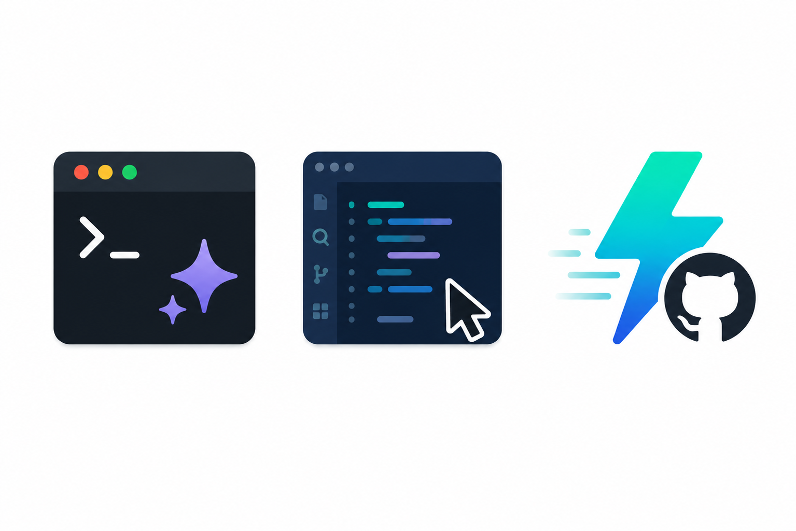
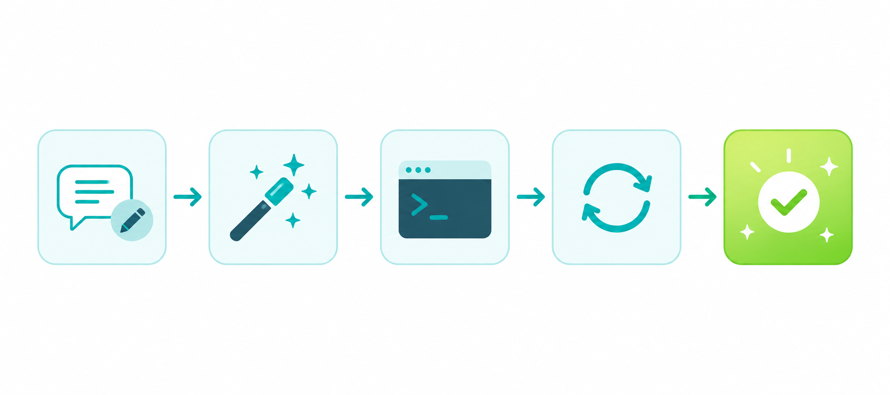

---
title: Vibe Coding 入门指南：用对话写出你的第一个程序
author: Sam
digest: 不需要学语法，不需要背命令。只要你能描述你想要什么，就能写代码。这就是 Vibe Coding。
---

## 什么是 Vibe Coding

2025 年 2 月，OpenAI 联合创始人 Andrej Karpathy 发了一条推文：

> 我现在基本上就是 "vibe coding" —— 完全放手给 AI，直接接受建议，完全不看 diff。

他给这种方式起了一个名字：**Vibe Coding**。

简单说就是：**你负责描述想法，AI 负责写代码。** 你不需要懂语法，不需要背 API，甚至不需要看懂每一行代码。只要你能说清楚 "我想要什么"，就能得到一个能跑的程序。

## 和传统编程有什么区别

| | 传统编程 | Vibe Coding |
|---|---|---|
| 你需要 | 学语法、查文档、调 bug | 描述需求、给反馈 |
| 谁写代码 | 你 | AI |
| 谁负责质量 | 你 | 你 + AI |
| 上手门槛 | 高 | 低 |
| 适合场景 | 生产系统、复杂架构 | 原型、工具、自动化 |

Vibe Coding **不是**要取代程序员。它是让非程序员也能用代码解决问题，同时让程序员能更快地完成工作。

## 你需要准备什么

### 1. 一个 AI 编程工具

推荐三个，选一个就行：

- **Claude Code** — Anthropic 出品，终端里直接用，能力强
- **Cursor** — 基于 VS Code，界面友好，适合新手
- **GitHub Copilot** — 集成在编辑器里，写代码时实时补全

### 2. 一个明确的小目标

第一次不要想着做一个完整的产品。从一个小工具开始：

- "帮我写一个脚本，把桌面上的截图按日期整理到文件夹"
- "帮我做一个网页，把我的读书笔记展示出来"
- "帮我写一个 Chrome 插件，自动屏蔽广告"

**越具体越好。**

## 五步完成你的第一次 Vibe Coding

### 第一步：描述你的需求

打开 AI 工具，用自然语言说清楚你要什么。不用管格式，像跟同事聊天一样就行：

> 我想要一个 Python 脚本。每天早上 9 点，自动检查我邮箱里有没有新的报销邮件，如果有，把邮件里的金额和日期提取出来，写进一个 Excel 表格里。

### 第二步：让 AI 生成代码

AI 会给你一段代码。**先别急着看懂它**，先跑起来。

### 第三步：运行并观察

把代码跑一遍。大概率不会一次完美，这很正常。你会看到报错信息——直接把报错信息复制粘贴给 AI。

### 第四步：迭代修改

跟 AI 说哪里不对：

> "报错了，说找不到 pandas 模块"
> "Excel 里日期格式不对，我想要 2025-01-15 这种格式"
> "能不能加一个功能，把超过 1000 块的报销标记成红色"

### 第五步：确认能用就行

代码能正确运行、解决了你的问题，就够用了。不需要追求优雅，不需要追求完美。

## 几个实用技巧

### 给 AI 足够的上下文

差的提示：

> 帮我写个网页

好的提示：

> 帮我写一个个人博客首页。我是个产品经理，主要写产品思考和行业观察。风格要简洁，黑白灰配色，要有文章列表和关于我的介绍。

### 一次只改一个东西

每次让 AI 改一个地方，确认没问题再改下一个。一次改太多，出错了不知道是哪个改动导致的。

### 保留能用的版本

每当你觉得 "现在这个版本还行"，就保存一份。这样后面改坏了可以回退。

### 让 AI 解释代码

如果你好奇代码在做什么，直接问：

> 用大白话解释一下这段代码在做什么

不要求自己看懂每一行，但了解大致逻辑会让你后面的需求描述更精准。

## 适合 Vibe Coding 的场景

- 个人工具和自动化脚本
- 网站和落地页
- 数据处理和分析
- Chrome 浏览器插件
- API 对接和小工具
- 学习和实验项目

**不太适合的场景：**

- 大规模生产系统
- 对安全性要求极高的项目
- 需要高性能优化的场景

## 常见问题

### 我完全不会编程，真的能用吗？

能。Vibe Coding 的核心就是用自然语言描述需求。你会用搜索引擎查问题，就会用 Vibe Coding 写程序。

### AI 生成的代码有 bug 怎么办？

正常现象。把报错信息给 AI，让它修。大多数 bug 一两轮对话就能解决。

### 我需要学什么编程语言吗？

不急着学。先用起来，等你发现 AI 生成的代码经常满足不了你的需求时，再针对性地学。

### 这样写出来的代码质量靠谱吗？

对于个人工具和内部项目，完全够用。如果要上线给用户用，建议找一个有经验的开发者做 code review。

## 写在最后

Vibe Coding 本质上是一种**新的编程范式**：从 "人写代码" 变成 "人描述意图，AI 写代码"。

它降低了编程的门槛，让更多人能用代码解决问题。它也改变了程序员的工作方式——从逐行编写变成高层的指导和审查。

**最好的学习方式就是动手试。** 现在打开一个 AI 工具，给自己定一个小目标，开始你的第一次 Vibe Coding。
